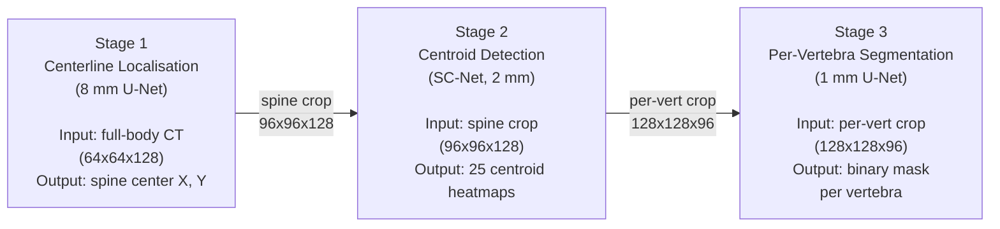

# SNET — 3-Stage Spinal Vertebrae Segmentation Pipeline


A modular Python implementation of a three-stage pipeline for automatic spinal vertebrae
localisation and segmentation from CT volumes, based on the VerSe challenge methodology.

## Pipeline Overview


---

| Stage | Model | Spacing | Input Shape | Output | Loss |
|-------|-------|---------|-------------|--------|------|
| 1 | Modified 3D U-Net | 8 mm | `[1, 64, 64, 128]` | Spine centerline heatmap | Weighted MSE |
| 2 | SC-Net (Local Appearance + Spatial Config) | 2 mm | `[1, 96, 96, 128]` | 25 centroid heatmaps | Modified L2 + sigma penalty |
| 3 | Modified 3D U-Net | 1 mm | `[2, 128, 128, 96]` | Binary segmentation mask | BCE + Dice |
## Installation

```bash
pip install -r requirements.txt
```

## Dataset Format

The pipeline expects a CSV file with these columns:

| Column | Description |
|--------|-------------|
| `name` | Subject identifier |
| `type` | Split: `train`, `val`, or `test` |
| `image_path` | Path to the CT NIfTI file (`.nii.gz`) |
| `mask_path` | Path to the segmentation mask NIfTI (optional for Stage 1) |
| `centroid_json_path` | Path to the centroid JSON file |

Centroid JSON format (VerSe convention):

```json
[
  {"direction": ["P", "I", "R"]},
  {"label": 17, "X": 94.8, "Y": 46.1, "Z": 19.1},
  {"label": 18, "X": 93.2, "Y": 48.5, "Z": 22.0}
]
```

## Usage

### Train a single stage

```bash
# Stage 1: spinal centerline localisation
python main.py --stage 1 --mode train

# Stage 2: vertebra centroid detection
python main.py --stage 2 --mode train

# Stage 3: per-vertebra binary segmentation
python main.py --stage 3 --mode train
```

### Run inference

```bash
# Single stage
python main.py --stage 1 --mode infer
python main.py --stage 3 --mode infer

# Full pipeline (all 3 stages sequentially)
python main.py --stage 123 --mode infer
```

### Override paths and device

```bash
# Custom CSV and checkpoint
python main.py --stage 2 --mode train --csv /path/to/dataset.csv --checkpoint /path/to/best.pth

# Force CPU
python main.py --stage 3 --mode infer --device cpu
```

### Use as a Python library

```python
from snet.config import STAGE1_CFG, STAGE2_CFG, STAGE3_CFG
from snet.stage1.model import UNet3D_Stage1
from snet.stage2.model import SCNet
from snet.stage3.model import UNet3D
from snet.stage1.infer import run_inference as stage1_infer
from snet.stage2.infer import run_inference as stage2_infer
from snet.stage3.infer import run_inference as stage3_infer
from snet.eval import compute_dice, compute_hausdorff

# Modify config before training
STAGE2_CFG["iterations"] = 100_000
STAGE2_CFG["lr"] = 1e-7

# Run inference
results = stage1_infer(csv_path="my_data.csv", checkpoint_path="model.pth")
```

## Configuration

All hyperparameters live in `snet/config.py`. Key settings per stage:

### Stage 1

| Parameter | Default | Description |
|-----------|---------|-------------|
| `target_spacing` | 8.0 mm | Coarse isotropic spacing |
| `input_size` | (64, 64, 128) | Padded/cropped volume shape |
| `sigma_spine` | 3.0 | GT Gaussian sigma (voxels) |
| `lr` | 1e-4 | Adam learning rate |
| `iterations` | 20,000 | Training iterations |

### Stage 2

| Parameter | Default | Description |
|-----------|---------|-------------|
| `target_spacing` | 2.0 mm | Isotropic spacing |
| `crop_size` | (96, 96, 128) | Spine crop (X, Y, Z) |
| `max_vertebrae` | 25 | C1-L6 (labels 1-25) |
| `sigma_init` | 5.0 | Initial learned sigma |
| `alpha` | 100.0 | Sigma penalty weight |
| `lr` | 1e-8 | Nesterov SGD learning rate |
| `iterations` | 50,000 | Training iterations |

### Stage 3

| Parameter | Default | Description |
|-----------|---------|-------------|
| `target_spacing` | 1.0 mm | Isotropic spacing |
| `crop_size` | (128, 128, 96) | Per-vertebra crop (X, Y, Z) |
| `heatmap_sigma` | 20.0 | Gaussian heatmap sigma |
| `sigmoid_threshold` | 0.5 | Binarisation threshold |
| `lr` | 1e-4 | Adam learning rate |
| `iterations` | 10,000 | Training iterations |

## Evaluation Metrics

| Stage | Metrics |
|-------|---------|
| 1 | Spine-center localisation error (mm), heatmap MSE |
| 2 | Per-vertebra centroid localisation error (mm) |
| 3 | Dice score, Hausdorff 95th percentile distance (mm) |

## Training Details

- **Stage 1**: Adam optimiser, weight decay 5e-4, weighted MSE loss (10x for spine regions)
- **Stage 2**: Nesterov SGD (momentum=0.9), weight decay 5e-4, modified L2 loss with learned per-vertebra sigma and alpha=100 penalty
- **Stage 3**: Adam optimiser, weight decay 1e-7, combined BCE + Dice loss (50/50 weighting)
- All stages use infinite data iterators (cycling through the dataset) up to a fixed iteration count
- Checkpoints are saved on best validation performance; latest state is always saved for crash recovery
- Preprocessed patches are cached as `.npz` files on disk to avoid repeated expensive resampling
